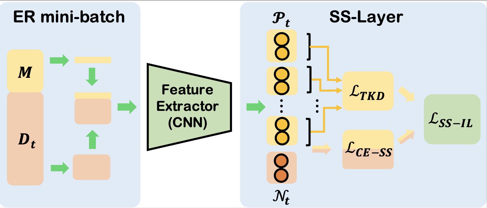
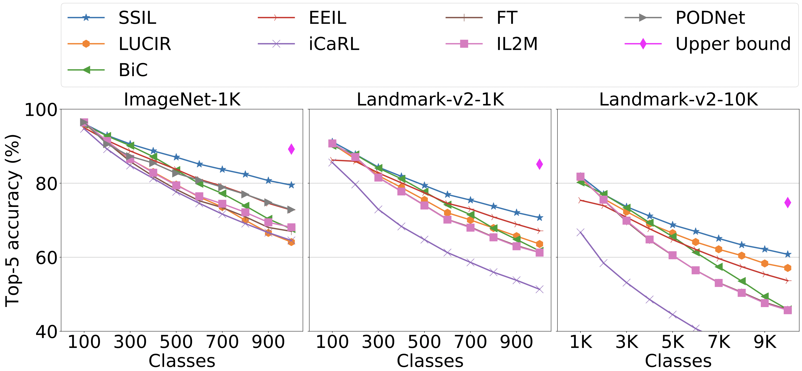
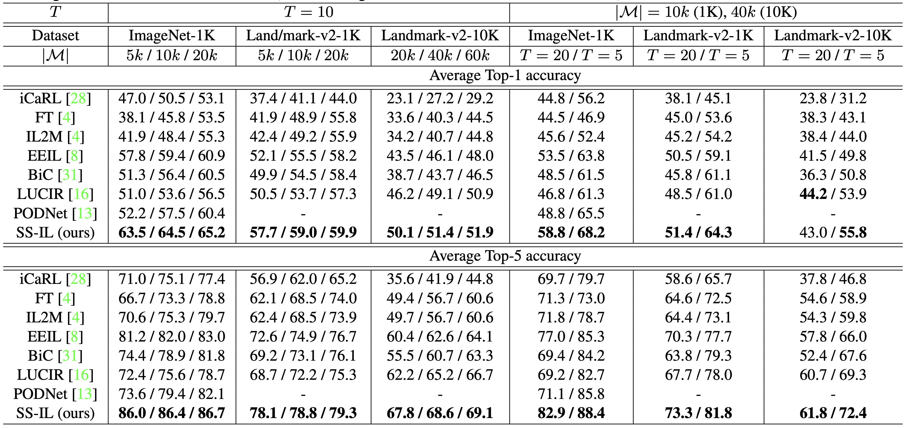

# SS-IL : Separated Softmax for Incremental Learning

------


## **Main methods**


<center> Figure 1. Illustration of SS-IL. The yellow regions represent the old classes, and red regions represent the new classes.</center>


## **Execution Details**

### Requirements

- Python3
- GPU: 1080Ti
- Pytorch: 1.6.0
- CUDA: 10.2

#### Download dataset
- ILSVRC 2012 : <http://image-net.org>
- Google Landmark Dataset v2 : <https://github.com/cvdfoundation/google-landmark>


### Reproducing Table 1


#### Execution command

For T=10, |M|=20k in ImageNet-1K,

```
# iCaRL
$ python3 main.py --date ICCV --trainer icarl --dataset Imagenet --base-classes 100 --step-size 100 --nepochs 60 --schedule 20 30 40 50 --gammas 0.2 0.2 0.2 0.2 --memory-budget 20000

# FT
$ python3 main.py --date ICCV --trainer ft --dataset Imagenet --base-classes 100 --step-size 100 --nepochs 100 --schedule 40 80 --gammas 0.1 0.1 --factor 4 --memory-budget 20000

# IL2M
$ python3 main.py --date ICCV --trainer il2m --dataset Imagenet --base-classes 100 --step-size 100 --nepochs 100 --schedule 40 80 --gammas 0.1 0.1 --factor 4 --memory-budget 20000

# EEIL
$ python3 main.py --date ICCV --trainer eeil --dataset Imagenet --base-classes 100 --step-size 100 --nepochs 40 --schedule 10 20 30 --gammas 0.1 0.1 0.1 --memory-budget 20000

# BiC
$ python3 main.py --date ICCV --trainer bic --dataset Imagenet --batch-size 256 --base-classes 100 --step-size 100 --nepochs 100 --schedule 30 60 90 --gammas 0.1 0.1 0.1 --memory-budget 20000

# LUCIR
$ python3 main.py --date ICCV --trainer rebalancing --dataset Imagenet --base-classes 100 --step-size 100 --debug 0 --nepochs 90 --schedule 30 60 --gammas 0.1 0.1 --memory-budget 20000

# PODNet
$ python3 main.py --date ICCV --trainer podnet --dataset Imagenet --lr 0.05 --batch-size 64 --base-classes 100 --step-size 100 --debug 0 --nepochs 90 --memory-budget 20000

# SS-IL
$ python3 main.py --date ICCV --trainer ssil --dataset Imagenet --replay-batch-size 32 --base-classes 100 --step-size 100 --nepochs 100 --schedule 40 80 --gammas 0.1 0.1 --factor 1 --memory-budget 20000 

```

#### 1. For other evaluation scenarios (e.g. T=5 or T=20), please modify base-classes and step-size.

#### 2. To train on Landmark-1K and Landmark-10K, please modify dataset as 'Google_Landmark_v2_1K' or 'Google_Landmark_v2_10K'


<center> Figure 2. Top-5 accuracy results on ImageNet-1K, Landmark-v2-1K, and Landmark-v2-10K datasets for T = 10. The exemplar size is |M| = 20k in ImageNet-1K and Landmark-v2-1K datasets, and |M| = 60k in Landmark-v2-10K dataset</center>



<center> Table 1. The results on various datasets and evaluation scenarios. The evaluation metrics are Average Top-1 and Top-5 accuracy. Accuracyis averaged over all the incremental tasks (i.e. including both initial task and incremental tasks)</center>


